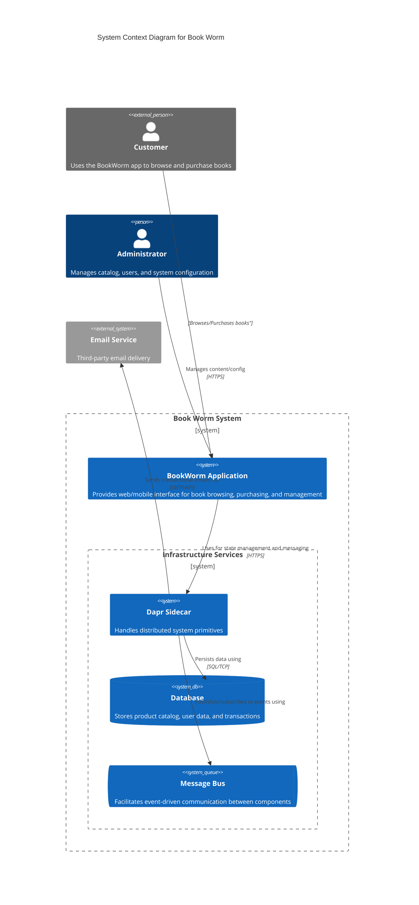
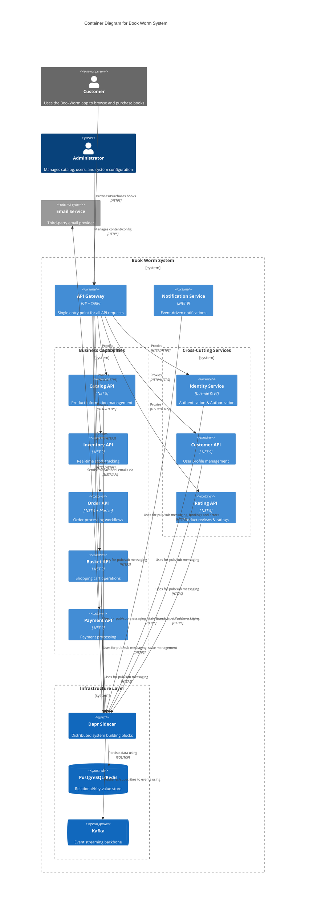

# BookWorm: Modern app development

<a href="https://github.com/foxminchan/BookWormOnDapr/blob/main/LICENSE">
	
</a>

## Introduction

⭐ This pet project is dedicated to streamlining microservices development using Aspire, Dapr, and the Radius Platform. Its primary objective is to provide a cutting-edge application development experience that prioritizes developer productivity, scalability, and reliability.

💡 The focus of this project is not only on business logic but also on the architecture, design, and development of a modern microservices application. It incorporates various design patterns, principles and concepts commonly used in microservices, including Domain-Driven Design (DDD), pub/sub, Sidecar Pattern, Event Sourcing, and CQRS.

<div>
  <a href="https://codespaces.new/foxminchan/BookWormOnDapr?quickstart=1">
    
  </a>
</div>

## The Goals of the Project

- [x] Building a cloud-native application with .NET Aspire and Dapr
- [x] Implementing a microservices architecture with DDD, CQRS, and Event Sourcing
- [x] Using the Sidecar Pattern to integrate Dapr with existing applications
- [x] Using Vertical Slice Architecture to organize the codebase
- [x] Using Duende IdentityServer for authentication and authorization
- [x] Using Kafka for pub/sub messaging
- [ ] Using NUKE for build automation
- [ ] Integrating LLM with the application
  - [ ] Leveraging the [Microsoft.Extensions.AI](https://learn.microsoft.com/en-us/dotnet/ai/ai-extensions)
  - [ ] Using Ollama with DeepSeek R2 model
- [ ] Integrating with the Radius Platform for deployment

## Software Architecture

### System Context Diagram



### Container Diagram



## Getting Started

### Prerequisites

For the development environment, you need to install the following tools:

- [.NET 9.0 SDK](https://dotnet.microsoft.com/download/dotnet/9.0)
- [Docker](https://www.docker.com/products/docker-desktop)
- [Dapr CLI](https://docs.dapr.io/getting-started/install-dapr-cli/)
- [Gitleaks](https://gitleaks.io/)

With deployment, you need to install the following tools:

- [k3d](https://k3d.io/) & [k9s](https://k9scli.io/)
- [Radius CLI](https://docs.radapp.io/installation/)

### Setting up user secrets

1. Open a terminal
2. Run the following command to set the user secrets for the `BookWorm.AppHost` project

```bash
dotnet user-secrets set "Parameters:SqlUser" "postgres"
dotnet user-secrets set "Parameters:SqlPassword" "yourcomplexpassword"
```

### Running the project

1. Clone the repository

```bash
git clone git@github.com:foxminchan/BookWormOnDapr.git
```

2. Initialize Dapr

```bash
dapr init
```

3. Run the project

```bash
dotnet run --project src/BuildingBlocks/BookWorm.AppHost/BookWorm.AppHost.csproj
```

> [!WARNING]
> Ensure that you have Docker running on your machine.

## Contributing

- Fork the repository
- Create a new branch for your feature
- Make your changes
- Create a pull request

## License

This project is licensed under the MIT License - see the [LICENSE](LICENSE) file for details.

## BookWorm

For a version of this app using Aspire and MassTransit, please visit the [BookWorm](https://github.com/foxminchan/BookWorm) repository.
